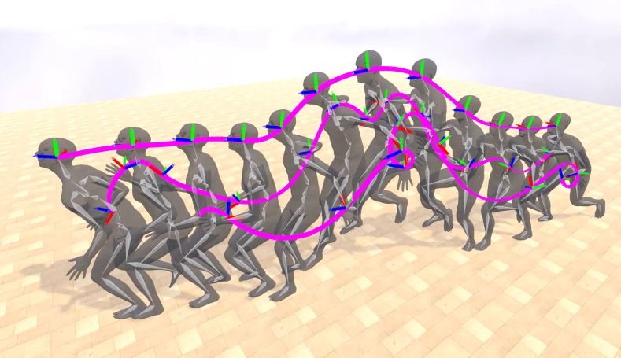
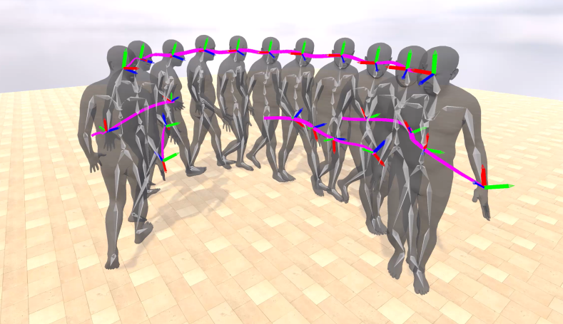

<h1 align="center">Rolling Prediction Models</h3>

<h3 align="center">From Sparse Signal to Smooth Motion: Real-Time Motion Generation with Rolling Prediction Models</h3>

  <p align="center">
    <!-- <a href="https://barquerogerman.github.io/RPM/"></a> -->
    <!-- <a href="https://arxiv.org/abs/xxxx.xxxx"></a> -->
    <!--  -->
  </p>

<br>

From headset + controllers (reliable)             |  From headset + hand-tracking (unreliable)
:-------------------------:|:-------------------------:
  |  


## 🔎 About
</br>
In extended reality (XR), generating full-body motion of the users is important to understand their actions, drive their virtual avatars for social interaction, and convey a realistic sense of presence. While prior works focused on spatially sparse and always-on input signals from motion controllers, many XR applications opt for vision-based hand tracking for reduced user friction and better immersion. Compared to controllers, hand tracking signals are less accurate and can even be missing for an extended period of time. To handle such unreliable inputs, we present Rolling Prediction Model (RPM), an online and real-time approach that generates smooth full-body motion from temporally and spatially sparse input signals. Our model generates 1) accurate motion that matches the inputs (i.e., tracking mode) and 2) plausible motion when inputs are missing (i.e., synthesis mode). More importantly, RPM generates seamless transitions from tracking to synthesis, and vice versa. To demonstrate the practical importance of handling noisy and missing inputs, we present GORP, the first dataset of realistic sparse inputs from a commercial virtual reality (VR) headset with paired high quality body motion ground truth. GORP provides >14 hours of VR gameplay data from 28 people using motion controllers (spatially sparse) and hand tracking (spatially and temporally sparse). We benchmark RPM against the state of the art on both synthetic data and GORP to highlight how we can bridge the gap for real-world applications with a realistic dataset and by handling unreliable input signals. Our code, pretrained models, and GORP dataset will be released upon acceptance.

<!--
## Running instructions
-->

## 📌 News
<!-- [2025-02-26] Our paper is available in [Arxiv](https://arxiv.org/abs/xxxx.xxxxx).-->
- [2025-02-xx] The code of RPM is available.

## 📝 TODO List
- [x] Release code for training, evaluation, and visualization.
- [] Release pretrained models.
- [] Release GORP dataset.

## 👩🏻‍🏫 Getting started

This code was tested on Python 3.10 + PyTorch 2.5.1. While other versions might work as well, we recommend using our conda environment to avoid unexpected issues.

1. Download the [human_body_prior](https://github.com/nghorbani/human_body_prior/tree/master/src) lib and [body_visualizer](https://github.com/nghorbani/body_visualizer/tree/master/src) lib and put them in this repo.

2. Register + download the SMPL-X model from [this link](https://smpl-x.is.tue.mpg.de/). Download + unzip the '*SMPL-X with removed head bun (NPZ)*'. Then move the `SMPLX_NEUTRAL.npz` file to this repo into: `./SMPL/smplx/neutral/model.npz`.

The repo should look like
```
rolling_prediction_models
├── body_visualizer
├──── mesh/
├──── tools/
├──── ...
├── human_body_prior/
├──── body_model/
├──── data/
├──── ...
├── SMPL/
├──── smplx/
├────── neutral/
├──────── model.npz
├── checkpoints/
├── data_loaders/
└── ...
```

3. Setup conda env:
```shell
conda env create -f environment.yml
conda activate rpm
```

This [README file](TO ADD) contains instructions on how to visualize, evaluate, and train the model.

## 📚 Citation

If you find our work helpful, please cite:

```bibtex
@inproceedings{barquero2025fromsparse,
  title={From Sparse Signal to Smooth Motion: Real-Time Motion Generation with Rolling Prediction Models},
  author={Barquero, German and Bertsch, Nadine and Marramreddy, Manojkumar and Chacón, Carlos and Arcadu, Filippo and Rigual, Ferran and He, Nicky Sijia and Palmero, Cristina and Escalera, Sergio and Ye, Yuting and Kips, Robin},
  booktitle={arXiv},
  year={2025}
}
```


## 🤝🏼 Acknowledgements

This project has used and is built on source codes shared by [body_visualizer](https://github.com/nghorbani/body_visualizer), [human_body_prior](https://github.com/nghorbani/human_body_prior), [AvatarPoser](https://github.com/eth-siplab/AvatarPoser), [AGRoL](https://github.com/facebookresearch/AGRoL). We thank the authors for their effort and open sourcing their works.


## 📚 License

![CC BY-NC 4.0][cc-by-nc-shield]

The majority of RPM code is licensed under CC-BY-NC, however portions of the project are available under separate license terms:
- Trimesh, [AvatarPoser](https://github.com/eth-siplab/AvatarPoser) and [MDM](https://github.com/GuyTevet/motion-diffusion-model) are licensed under the MIT license;
- Human Body Prior is licensed under a custom license for non-commercial scientific research purposes, available at [link](https://github.com/nghorbani/human_body_prior/blob/master/LICENSE);
- Body Visualizer is licensed under a custom license for non-commercial scientific research purposes, available at [link](https://github.com/nghorbani/body_visualizer/blob/master/LICENSE).

[cc-by-nc-shield]: https://img.shields.io/badge/License-CC%20BY--NC%204.0-lightgrey.svg
